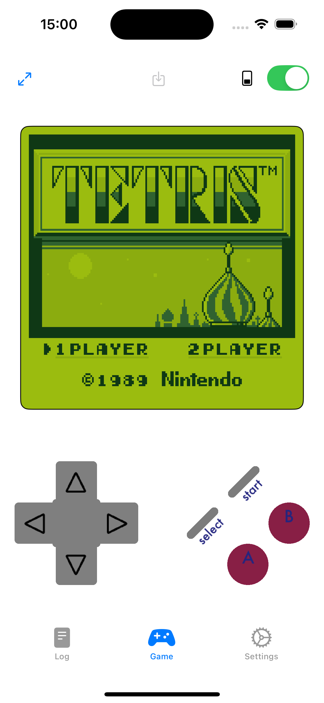
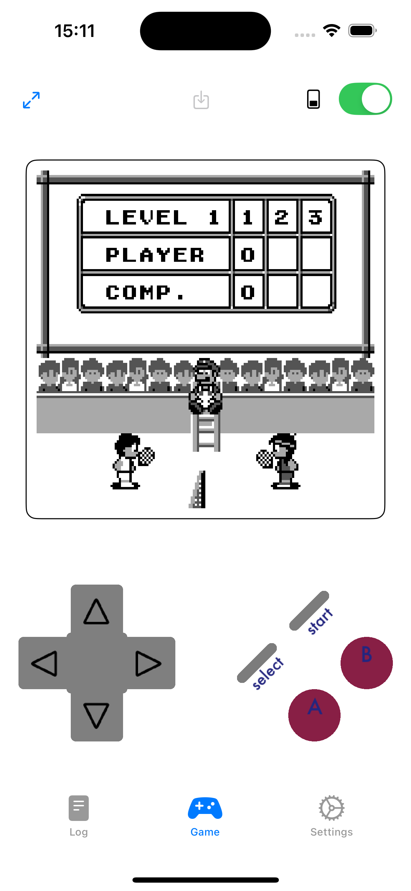
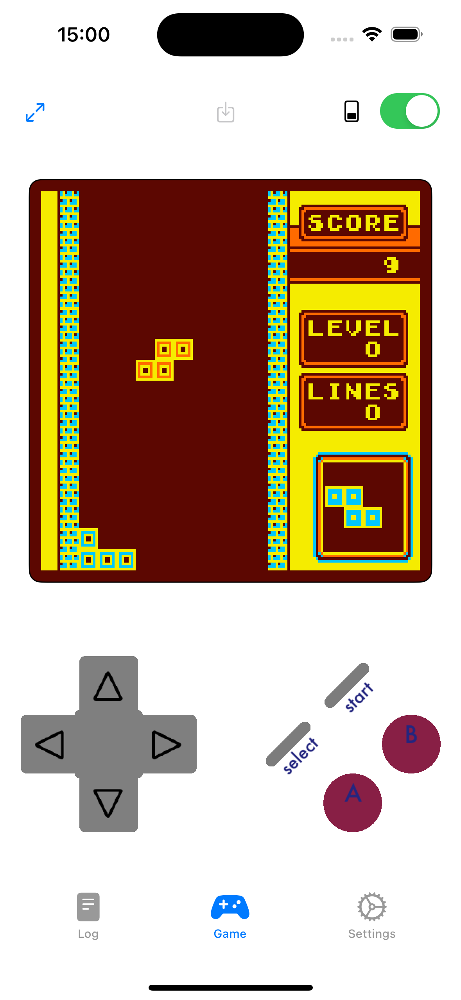
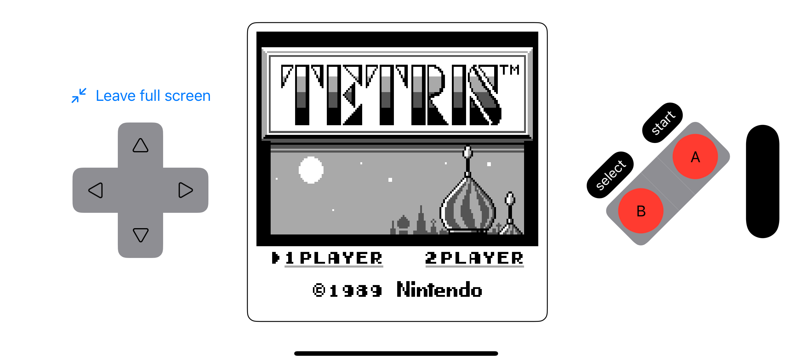
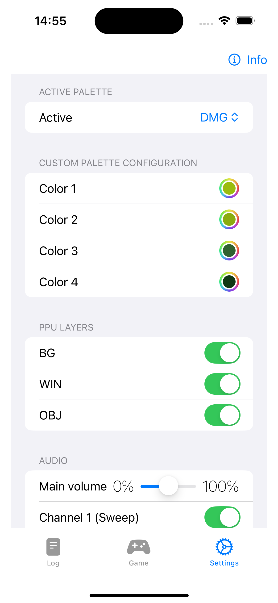
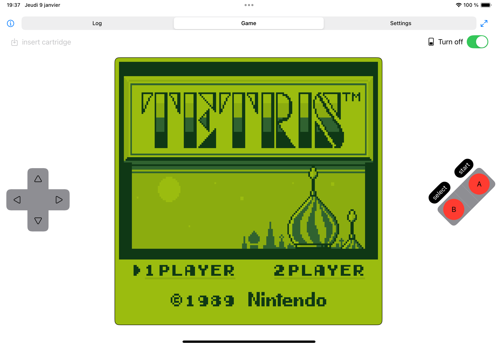
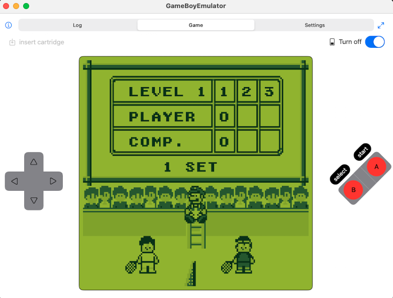

# Game Boy Emulator

A Game Boy Emulator for iOS / iPadOS / macOS written in Swift.

With controller supports and palette customization!

**Status** Games that don't need MBC supports or advance CPU tricks work, e.g Tetris, Tennis...

**Work in progress** (still under active development) MBC and Audio coming (ETA: when its done!).
## Compatibility

This projects aims at being compatible with the following platforms:

- iOS (14+)
- iPadOS (14+)
- macCatalyst (14+)
- [Swift Playgrounds](https://www.apple.com/fr/swift/playgrounds/) (both macOS and iPadOS (WIP @see roadmap))

## Getting started

Open either `./src/app/GameBoyEmulator/GameBoyEmulator.xcodeproj` or `./src/app/GameBoyEmulator.swiftpm` with `xcode` on macOS.

_n.b [Swift Playgrounds](https://www.apple.com/fr/swift/playgrounds/) is also supported on macOS but debugging remains impossible as long as performance which are tied to debug xcscheme._ 

## Structure

This project is (for now) a mono repo that holds the following:

- A core package package `GBKit` in `./packages/GBKit` (where the magic happens)
- A SwiftUI package `GBUIKit` in `./packages/GBUIKit` (SwiftUI frontend)
- The emulator app in `./src/app` (the macOS/iOS/iPadOS app itself)

## Roadmap

1. Finalize GBKit (`./packages/GBKit`) (MBC, APU...)

2. Release GBKit (`./packages/GBKit`) as a standalone Swift Package (with its own git) read to use in any Swift emulator project.

3. Release GBUIKit (`./packages/GBUIKit`) as a standalone Swift Package (with its own git) read to use in any Swift emulator project.

4. Create another front-end based on [SDL](https://www.libsdl.org) via [SwiftSDL](https://github.com/KevinVitale/SwiftSDL)

5. Restore supports for [Swift Playgrounds](https://www.apple.com/fr/swift/playgrounds/) implies to reference GBKit and GBUIKit as dependencies.

## Screenshots

| iOS (game view / DMG palette) | iOS (game view / MGB palette) | iOS (game view / custom palette) | iOS (game view / landscape fullscreen) | iOS (settings view) | iPadOS | macOS |
| - |  - |  - | - | - | - | - |
|  |   |   |  |  |  |  |

## side notes

Game Boy and Nintendo are used under [nominative use](https://en.wikipedia.org/wiki/Nominative_use). As for logo's bytes inclusion please read [Sega v. Accolade](https://en.wikipedia.org/wiki/Sega_v._Accolade).