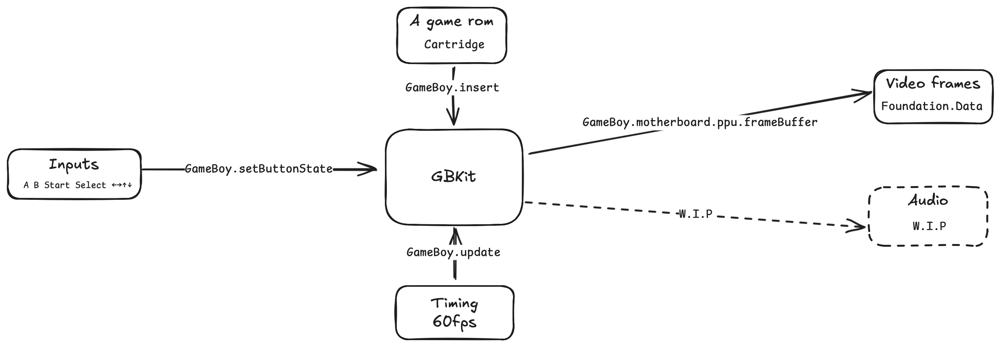
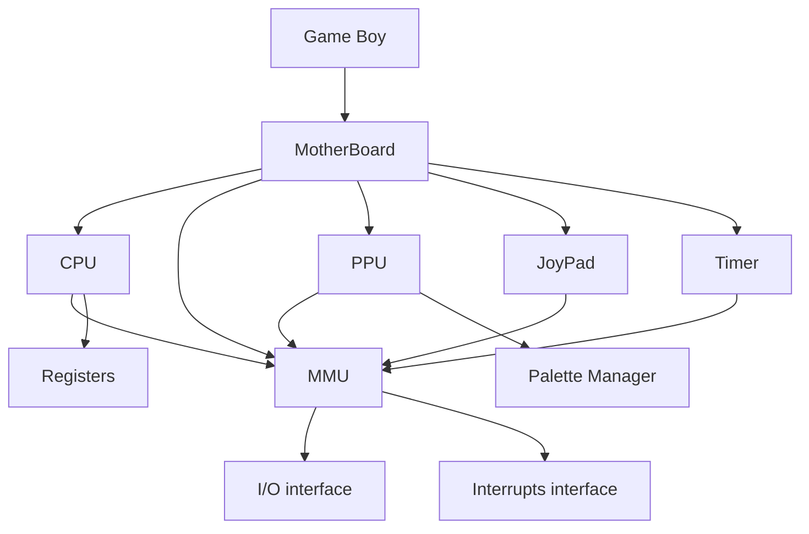

# GBKit

Core package to emulate GameBoy.

## Miletones

- (Done) CPU
- (Done) PPU
- (TODO) MBC handling
- (TODO) Finish unit tests
- (Next) APU
- (Next) Move from `XCTest` to new Swift `Testing`
- (Later) GBC Support

## Architecture

From a game rom, inputs and 60fps timing GBKit produces video frames and audio (upcoming).

### Components dependency tree

## Quality 

### gameboy doctor

This repo is compliant with [gameboy doctor](https://github.com/robert/gameboy-doctor) for the following roms [found here](https://github.com/retrio/gb-test-roms/tree/master/cpu_instrs):

 - 01-special.gb
 - 03-op sp,hl.gb
 - 04-op r,imm.gb
 - 05-op rp.gb
 - 06-ld r,r.gb
 - 07-jr,jp,call,ret,rst.gb
 - 08-misc instrs.gb
 - 09-op r,r.gb
 - 10-bit ops.gb
 - 11-op a,(hl).gb

The following rom still needs to be compliant: 

- 02-interrupts.gb

_n.b Some initialization are required in order to be compliant with this tool (set F to 0xB0, MMU must return to 0x90 for LY (0xFF44), CPU must log at each instruction via cpu.registers.describe())_

### Unit test

This project contains some unit tests, objective is to test each core fonction of the implementation.

## Useful links

### Introduction

- [The ultimate Gameboy talk](https://youtu.be/HyzD8pNlpwI?si=Auf-_N2_Vzbvg6b7)

### Source documentation

- [opcode table](https://izik1.github.io/gbops/)
- [Game Boy Development community](https://gbdev.io)
- [Game Boy Development wiki](https://gbdev.gg8.se/wiki/articles/Main_Page)

- [Pan docs](https://gbdev.io/pandocs/Specifications.html)
- [Pan docs / memory map](https://gbdev.io/pandocs/Memory_Map.html)
- [Pan docs / CPU Instruction Set](https://gbdev.io/pandocs/CPU_Instruction_Set.html)
- [Pan docs / Power up sequence](https://gbdev.io/pandocs/Power_Up_Sequence.html)

- [Everything You Always Wanted To Know About GAMEBOY * * but were afraid to ask](http://www.devrs.com/gb/files/gbspec.txt)

### Similar project

- [Azayaka (c++)](https://github.com/7thSamurai/Azayaka)
- [Cinoop (c)](https://github.com/CTurt/Cinoop/)
- [CoreBoy (c#)](https://github.com/davidwhitney/CoreBoy)
- [Gambatte (c++)](https://github.com/libretro/gambatte-libretro/)
- [gamebert (go)](https://github.com/robert/gamebert)
- [gameboy-emulator (typescript)](https://github.com/roblouie/gameboy-emulator)
- [IronBoy (rust)](https://github.com/nicolas-siplis/IronBoy)
- [jitboy (c)](https://github.com/sysprog21/jitboy)
- [GameBoy (js)](https://github.com/vpoupet/GameBoy)
- [PyBoy (python)](https://github.com/Baekalfen/PyBoy)
- [Mooney gb (rust)](https://github.com/Gekkio/mooneye-gb)
- [SameBoy (c)](https://github.com/LIJI32/SameBoy)

### Worth reading articles

- [A journey into GameBoy emulation](https://robertovaccari.com/blog/2020_09_26_gameboy/)
- [Building a Gameboy From Scratch](https://raphaelstaebler.medium.com/building-a-gameboy-from-scratch-part-1-51d05496783e)
- [DMG-01: How to Emulate a Game Boy](https://rylev.github.io/DMG-01/public/book/introduction.html)
- [Émuler la gameboy (fr)](https://www.hr-team.net/emuler-la-gameboy/)
- [emudev q00.gb](https://emudev.de/gameboy-emulator/overview/)
- [Gamebert: a Game Boy emulator built by Robert](https://robertheaton.com/gamebert/)
- [Gameboy emulation](http://www.codeslinger.co.uk/pages/projects/gameboy/beginning.html)
- [Gameboy Doctor: debug and fix your gameboy emulator](https://robertheaton.com/gameboy-doctor/)
- [GameBoy-Emulation-in-JavaScript](http://imrannazar.com/GameBoy-Emulation-in-JavaScript:-Interrupts)
- [The Gameboy Emulator Development Guide](https://hacktix.github.io/GBEDG/)
- [Tetris Title Screen](https://nnarain.github.io/2016/09/24/GameboyEmulator-TitleScreen.html)
- [Reverse Engineering the Gameboy Boot Screen](https://catskull.net/gameboy-boot-screen-logo.html)
- [Programming A Gameboy Color Emulator](https://mattbruv.github.io/gameboy-crust/)
- [Writting an emulator: the first steps](https://blog.tigris.fr/2019/07/09/writing-an-emulator-the-first-steps/)
- [Writing an emulator: memory management](https://blog.tigris.fr/2019/07/28/writing-an-emulator-memory-management/)
- [Writing an emulator: the first pixel](https://blog.tigris.fr/2019/09/15/writing-an-emulator-the-first-pixel/)
- [Writing an emulator: the first (real) pixel](https://blog.tigris.fr/2019/10/30/writing-an-emulator-the-first-real-pixel/)
- [Writing an emulator: timing is key](https://blog.tigris.fr/2021/07/28/writing-an-emulator-timing-is-key/)
- [GameRoy: JIT compilation in High-Accuracy Game Boy Emulation](https://rodrigodd.github.io/2023/09/02/gameroy-jit.html)
- [A Visual Guide to the Gameboy's Half-Carry Flag](https://robdor.com/2016/08/10/gameboy-emulator-half-carry-flag/)
- [A Look At The Game Boy Bootstrap: Let The Fun Begin!](https://realboyemulator.wordpress.com/2013/01/03/a-look-at-the-game-boy-bootstrap-let-the-fun-begin/)
- [WTF is the DAA instruction?](https://ehaskins.com/2018-01-30%20Z80%20DAA/)
- [Demystifying the GameBoy/SM83’s DAA Instruction](https://blog.ollien.com/posts/gb-daa/)
- [Game Boy Sound Emulation](https://nightshade256.github.io/2021/03/27/gb-sound-emulation.html)
- [Gameboy sound hardware](https://gbdev.gg8.se/wiki/articles/Gameboy_sound_hardware)

### forums / threads / questions

- https://www.reddit.com/r/EmuDev/comments/tl1pli/i_dont_know_how_to_implement_the_main_loop_gb/
- https://www.reddit.com/r/EmuDev/comments/4o2t6k/how_do_you_emulate_specific_cpu_speeds/
- https://www.reddit.com/r/EmuDev/comments/utyx2g/looking_for_help_understanding_gameboy_clock/
- https://www.reddit.com/r/EmuDev/comments/5gkwi5/gb_apu_sound_emulation/
- https://www.reddit.com/r/Gameboy/comments/a1c8h0/what_happens_when_a_gameboy_screen_is_disabled/
- https://www.reddit.com/r/EmuDev/comments/5gkwi5/comment/dat3zni

- https://forums.nesdev.org/viewtopic.php?t=9088
- https://forums.nesdev.org/viewtopic.php?t=16621
- https://forums.nesdev.org/viewtopic.php?t=15944

- https://github.com/Gekkio/mooneye-gb/issues/39#issuecomment-265953981

- [How does the Gameboy's memory bank switching work?](https://retrocomputing.stackexchange.com/questions/11732/how-does-the-gameboys-memory-bank-switching-work)
- [How does Game Boy / Sharp LR35902 HRAM work?](https://retrocomputing.stackexchange.com/a/11943)

### Communities

- [/r/EmuDev](https://www.reddit.com/r/EmuDev/)
- [/r/EmuDev discord](https://discord.com/invite/7nuaqZ2)

### Paper

- [Emulation of Nintendo Game Boy (DMG-01)](https://github.com/Baekalfen/PyBoy/blob/master/PyBoy.pdf)

### General knowledge

- [understanding half carry](https://gist.github.com/meganesu/9e228b6b587decc783aa9be34ae27841)
- [Two's complement](https://en.wikipedia.org/wiki/Two%27s_complement)

### Quality

- https://github.com/aappleby/GBMicrotest
- https://github.com/adtennant/GameboyCPUTests
- [Documenting swift code](https://stackoverflow.com/a/28633899)

### Documents

- [Game Boy: Complete Technical Reference by gekkio](https://gekkio.fi/files/gb-docs/gbctr.pdf)

### Test roms

- https://github.com/mattcurrie/dmg-acid2
- https://github.com/retrio/gb-test-roms
- https://github.com/c-sp/gameboy-test-roms?tab=readme-ov-file

### GB Source code

- [Tetris GB decompilation project](https://github.com/osnr/tetris)

### Reference

- [official swift documentation](https://www.swift.org/documentation/)
- [official GameBoy programming manual (internet archive)](https://ia803208.us.archive.org/9/items/GameBoyProgManVer1.1/GameBoyProgManVer1.1.pdf)
- [GameBoy CPU manual (internet archive)](https://archive.org/details/gbcpuman_v1.01)

### Misc

- https://github.com/gbdev/awesome-gbdev
- https://datacrystal.romhacking.net/wiki/Tetris_(Game_Boy):RAM_map

## side notes

Game Boy and Nintendo are used under [nominative use](https://en.wikipedia.org/wiki/Nominative_use). As for logo's bytes inclusion please read [Sega v. Accolade](https://en.wikipedia.org/wiki/Sega_v._Accolade).
